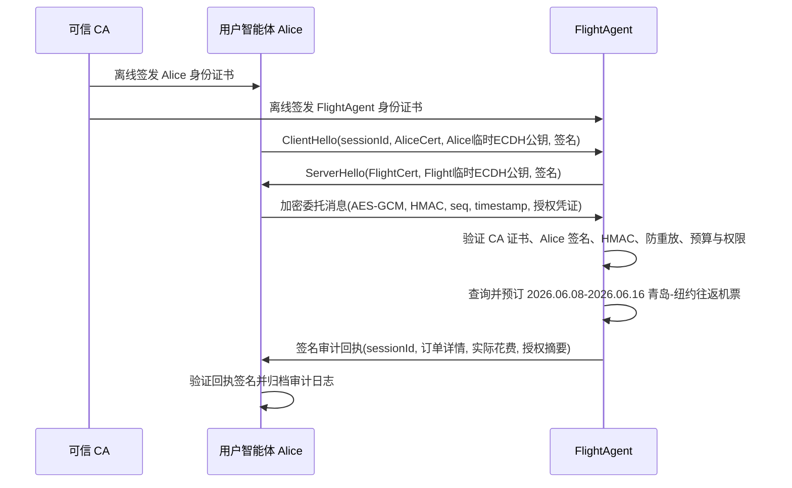

# 工作日志

> 来源：`密码学引论 / experiment/third_experiment/工作日志.md`

**注：加星号的工作日志是关键转折，思路启发，或者灵感迸发，对实验有关键作用，理解的部分**

## 问题
请针对上述 AI 智能体协作航班预订场景，结合密钥建立协议、电子支付协议等技术，设计 AI智能体协作安全协议。

1. 你认为该 AI 智能体协作安全协议还应满足哪些安全目标？请补全上述安全性目标，完整描述该协议应满足的安全性要求。

2. 给出AI智能体协作安全协议的详细描述及流程图展示，对关键步骤给出设计理由解释。


3. 给出关键算法代码及效率测试数据，包括以下异常测试实验环节.

（1） 重放攻击测试：截取历史合法消息，重复发送，验证序列号+时间戳防重放机制是否生效。

（2）授权扩权测试：手动篡改授权凭证预算金额，验证签名校验是否拦截篡改请求，禁止扩权。

（3） 消息篡改测试：修改传输中的订单价格、行程信息，验证 HMAC完整性校验是否识别篡改。

（4）伪造身份测试：使用非法凭证、伪造智能体身份发起请求，验证身份绑定机制是否拦截非法接入。


## 日志

2026年6月3日

【9:00 】
这个AI智能体要自己写吗？
【9:07】
明白了，应该是使用Agent2Agent协议
这里面有一些现成的代码可以调用
【9:08】
怎么使用这些代码？
【9:30】
搞到Claude api
【9:32】
开始

启动远端服务
git clone https://github.com/a2aproject/a2a-samples.git
cd a2a-samples/samples/python/agents/helloworld
uv run .

客户端
cd a2a-samples/samples/python/agents/helloworld
uv run test_client.py

注意uv是类似pip的一个东西
uv pip install 用来安装python库
```json

task {

  id: "cdcee06f-943b-4cc7-990a-03c663db4eed"
context_id: "c8f81517-ed8e-44cb-8fed-73a40a589a94"

  status {

    state: TASK_STATE_COMPLETED

    message {

      message_id: "ceb67a35-a9ff-4a3c-b485-d112d9dd705d"

      role: ROLE_AGENT

      parts {

        text: "Request is completed!"

      }

    }

    timestamp {

      seconds: 1780450580

      nanos: 579712000

    }

  }

  artifacts {

    artifact_id: "a7266601-ba6e-42cf-bd9c-eaba47ecfbf8"

    parts {

      text: "Hello, World! I have received your request (hey)"

      media_type: "text/plain"

    }

  }

  history {

    message_id: "6dc2c353-ab62-4cc5-b3da-ba8a52404538"

    context_id: "c8f81517-ed8e-44cb-8fed-73a40a589a94"

    task_id: "cdcee06f-943b-4cc7-990a-03c663db4eed"

    role: ROLE_USER

    parts {

      text: "hey"

    }

  }

  history {

    message_id: "adb7e821-1fd8-40c0-b28a-1d4b31196924"

    role: ROLE_AGENT

    parts {

      text: "Processing request..."

    }

  }

}
```
会生成一个这种类似json的东西

【9:38】

不需要api key？？？

阅读一下代码，原来只会返回固定的结果
肯定还是要接入api的

【9:41】
开始写flightagent

【9:45】

看到sample里面还有一些东西，看看能不能用

有一个travel agent

尝试让codex阅读一下a2asample项目

codex正在思考

【9:53】
codex认为这里还有一个更贴题的样例：samples/python/agents/signing_and_verifying 专门演示 AgentCard 签名验证。也就是说，这个仓库可以同时提供“智能体身份声明/发现”的 A2A 框架，以及“签名 metadata/上下文”的扩展样式，但作业里要求的预算凭证、HMAC、重放测试需要我们自己补一层。

【9:55】
codex已写完四个测试：
我看了 `/Users/infinite/a2a-samples`，里面最有用的是：

- `extensions/secure-passport`：可以承载 Alice 发给 FlightAgent 的授权凭证，类似 `clientId + sessionId + state + signature`。
- `samples/python/agents/signing_and_verifying`：可以参考 AgentCard/身份声明签名验证。
- A2A 的 `Message.metadata` 和 `tasks/send` 结构：可以包装“带授权约束的委托任务”。

但它不能直接满足作业全部要求，还需要自己补 CA 证书、会话密钥协商、HMAC、防重放、预算不可篡改和审计回执。我已经在当前工作区做了一个可运行原型和中文说明：

- [协议演示代码](/Users/infinite/Documents/New%20project/ai_agent_security_protocol_demo.py)
- [中文设计说明](/Users/infinite/Documents/New%20project/AI智能体协作安全协议_设计说明.md)

我也跑过测试了，四类异常都能拦截：

```text
normal booking: PASS
replay attack: PASS
authorization escalation: PASS
message tampering: PASS
forged identity: PASS
```

效率测试 300 轮大概是：

```text
handshake_avg_ms: 1.598
booking_avg_ms: 0.579
booking_p95_ms: 0.589
```

结论：这份 `a2a-samples` 可以作为“协议背景 + A2A 消息结构 + Secure Passport 授权扩展 + AgentCard 签名验证”的依据；真正交作业时，用我补的 demo 来覆盖密码学安全目标和异常实验会更完整。

## **【9:57】** **
**恍然大悟，确实不需要api**
**用户向用户智能体 Alice 下发指令：“预订下周（2026.06.08-2026.06.16） 青岛—纽约往返机票，总预算不超过 10000元，单人出行”**
**实质就是这样一个固定的指令罢了**

**要做的事是用密码学协议实现这里面的交互，重点是交互的协议，不是交互内容**

【10:00】
询问codex如何实现CA的

【10:02】
询问codex如何实现Alice

【10:11】
询问codex 如何实现flightagent

【10:12】
审阅codex代码，开始复盘、质疑

CA部分似乎找不出毛病

## 【10:20】 **

我承认我现在对A2A一无所知，系此原因无法质疑codex
遂开始阅读官方文档

注意到本次实验其实就是机票预订代理

a2a解决的问题是，面对不同的agent，需要一个统一的标准，协议来交互

在这次实验里，表现为alice和flight agent的交互？

**本质就是让Alice和flightagent协同工作**

 A2A互动中的核心参与者[¶](https://a2a-protocol.org/latest/topics/key-concepts/#core-actors-in-a2a-interactions "永久链接")

- **用户**：最终用户，可以是人工操作员，也可以是自动化服务。用户发起请求或定义目标，这些都需要一个或多个人工智能代理的协助。
- **A2A客户端（客户端代理）**：代表用户执行操作的应用程序、服务或其他人工智能代理。客户端使用A2A协议发起通信。
- **A2A 服务器（远程代理）**：一种人工智能代理或代理系统，它公开一个实现了 A2A 协议的 HTTP 端点。它接收来自客户端的请求，处理任务，并返回结果或状态更新。从客户端的角度来看，远程代理作为一个不透明（黑盒）系统运行，这意味着它的内部运作、内存或工具均不对外公开。

这里就是让Alice作为客户端代理，flightagent作为服务器代理

【10:45】
思考工作流程
核心交互逻辑：Alice 无直接预订权限，作为任务发起与权限管控主体，向FlightAgent下发带授权约束的委托任务，严格限定总预算 10000元，禁止智能体超支、篡改预算。

所以Alice怎么生成这个授权约束的委托任务？

Alice 生成的授权凭证包含：总预算、授权权限、授权时效、被授权智能体 ID，完整内容由 Alice私钥全程签名锁定。一旦凭证内容被篡改，签名校验失效，任务自动终止，杜绝授权扩权、越权操作。同时授权凭证仅单次会话有效，不可复用。

我们来看一下codex写的部分

```python
auth = {
    "issuer_agent_id": "agent:alice",
    "delegatee_agent_id": "agent:flight",
    "session_id": session_id,
    "budget_cny": 10000,
    "permissions": ["flight.search", "flight.book"],
    "valid_from": now_iso(),
    "valid_until": (datetime.now(timezone.utc) + timedelta(minutes=10)).isoformat(),
    "nonce": secrets.token_hex(16),
    "nonce_used": False,
    "itinerary": {
        "from": "Qingdao",
        "to": "New York",
        "depart_date": "2026-06-08",
        "return_date": "2026-06-16",
        "passengers": 1,
    },
}

```
 航班预订智能体（FlightAgent）：业务执行方；仅拥有机票查询、预订权限，

仅可使用授权内机票预算，不可篡改总预算与授权规则。

总预算就是budget_cny

授权权限就是查询和预订，也就是search和book

授权时效，这里用到了python的date模块
`datetime.datetime.isoformat()` 方法是 Python 标准库 `datetime` 模块中一个非常实用的功能。它的主要作用是将一个 `datetime` 对象转换为一个符合 ISO 8601 国际标准 格式的字符串。

ISO 8601 是一种国际标准，用于日期和时间的表示方法，其格式具有很好的可读性和机器可解析性，因此在数据交换、API 接口和日志记录中非常常用。
输出结果类似: 2025-12-25T10:30:00.123456+08:00

这里时效是10分钟，确实应当包括起点valid_from,不然就可以随便伪造了


被授权智能体id delegatee_agent_id": "agent:flight"


然后用私钥签名，看上去没什么问题

【11:02】
认真的看了一下官方的代码
codex写的是玩具！！！只是模拟，根本没有调用a2a的sdk


完全和官方迥异
此番行径绝不能接受

又将a2a的代码喂给codex，让他使用真实的a2a sdk

【11:34】
已完全重建项目
见使用文档