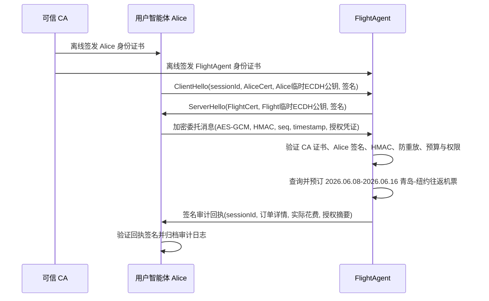

# AI 智能体协作航班预订安全协议设计

> 来源：`密码学引论 / experiment/third_experiment/设计文档.md`

  

## 1. a2a-samples 是否可用

  

可以用，但建议作为协议框架与作业引用材料，而不是直接照搬。`/Users/infinite/a2a-samples` 中有三块内容与本题高度相关：

  

1. A2A 基础交互：`tasks/send`、`Message.metadata`、`AgentCard` 等结构可对应 Alice 向 FlightAgent 委托任务。

2. Secure Passport 扩展：`extensions/secure-passport` 已定义 `clientId`、`sessionId`、`state`、`signature`，非常适合承载本题的授权凭证。

3. AgentCard 签名样例：`samples/python/agents/signing_and_verifying` 演示智能体身份声明签名与验证，可对应 CA 背书的身份绑定。

  

本作业需要额外补充：离线 CA 证书、会话密钥协商、AES-GCM 加密、HMAC 完整性、序列号/时间戳防重放、授权预算不可篡改、签名审计回执。

  

## 2. 补全安全目标

  

除题目已给出的可验证身份绑定、传输机密性、授权不扩权、执行可追溯外，还应满足：

  

1. 消息完整性与来源认证：每条业务消息携带 HMAC，接收方用会话密钥验证，防止订单价格、行程、授权元数据被中途篡改。

2. 抗重放攻击：每条消息包含 `sessionId + seq + timestamp + nonce`，接收方维护已见序列号窗口，历史合法消息重复发送会被拒绝。

3. 会话密钥前向安全：Alice 与 FlightAgent 使用临时 ECDH/X25519 建立会话密钥，长期签名密钥只用于身份与授权签名。

4. 最小权限与目的限制：FlightAgent 只获得 `flight.search`、`flight.book` 权限，且只能在指定会话、指定航线、指定预算、指定有效期内使用。

5. 凭证单次有效与不可转授权：授权凭证绑定 `delegatee_agent_id`、`session_id` 和随机 nonce，不允许转给其他智能体，也不可跨会话复用。

6. 电子支付约束：支付指令应采用冻结/预授权模型，实际扣款金额不得超过授权预算，最终支付金额写入签名回执。

7. 审计日志完整性：本地保存证书、授权凭证摘要、消息摘要、订单回执和验签结果，必要时可对日志链式哈希，防删除和防插入。

8. 输入安全与策略合规：来自外部 AgentCard、消息、订单字段均视为不可信输入，需做格式校验、能力校验和预算策略校验。

  

## 3. 协议流程

  



  

关键设计理由：

  

1. CA 离线签发证书：符合题目“无需在线验证”的要求，接收方只需持有 CA 公钥即可验证身份凭证。

2. ECDH 建立会话密钥：避免长期密钥直接加密业务数据，提升会话隔离性。

3. 授权凭证由 Alice 私钥签名：预算、权限、时效、被授权方、会话 ID 被整体锁定，任何改动都会导致验签失败。

4. AES-GCM + HMAC：AES-GCM 提供机密性，外层 HMAC 明确覆盖消息头、序列号、时间戳和密文，便于异常测试展示完整性拦截。

5. 签名回执：FlightAgent 对订单与花费签名，Alice 可事后验签，满足不可抵赖和审计追溯。

  

## 4. 关键代码与测试

  

真正接入 A2A SDK 的关键代码见当前工作区：

  

- `/Users/infinite/Documents/New project/a2a_secure_flight_agent/__main__.py`：FlightAgent A2A Server，按 `travel_planner_agent` 风格创建 `AgentCard`、`AgentSkill`、`A2AStarletteApplication`。

- `/Users/infinite/Documents/New project/a2a_secure_flight_agent/agent_executor.py`：FlightAgent 的 `AgentExecutor`，从 `RequestContext.message.metadata` 读取安全握手或加密信封。

- `/Users/infinite/Documents/New project/a2a_secure_flight_agent/alice_client.py`：Alice A2A Client，使用 `A2ACardResolver`、`ClientFactory`、`create_text_message_object` 发起请求。

- `/Users/infinite/Documents/New project/a2a_secure_flight_agent/security.py`：CA、授权凭证、ECDH、AES-GCM、HMAC、防重放和签名回执。

  

运行 FlightAgent 服务端：

  

```bash

cd "/Users/infinite/Documents/New project/a2a_secure_flight_agent"

uv run .

```

  

另开终端运行 Alice 客户端：

  

```bash

cd "/Users/infinite/Documents/New project/a2a_secure_flight_agent"

uv run alice_client.py

```

  

实测已通过：Alice 先访问 `/.well-known/agent-card.json` 获取 FlightAgent 的 AgentCard，再连续发送两次 A2A `POST /` 请求，分别完成安全握手和加密订票委托，最终收到 FlightAgent 私钥签名的审计回执，实际花费 `9288 CNY`。

  

四类攻击实验运行：

  

```bash

cd "/Users/infinite/Documents/New project/a2a_secure_flight_agent"

uv run attack_tests.py

```

  

实测输出：

  

```text

- replay attack: PASS (replay rejected: duplicated session sequence)

- authorization escalation: PASS (InvalidSignature)

- message tampering: PASS (message rejected: HMAC integrity check failed)

- forged identity: PASS (InvalidSignature)

```

  

## 5. 小组成员贡献模板

  

可按实际情况填写：

  

1. 成员 A：协议总体设计、安全目标补全、流程图绘制。

2. 成员 B：CA 证书、签名验签、授权凭证设计。

3. 成员 C：会话密钥协商、AES-GCM/HMAC 消息保护实现。

4. 成员 D：四类异常攻击实验、效率测试、结果整理与报告排版。

  

## 6. 参考文献

  

1. Model Context Protocol (MCP). https://modelcontextprotocol.io/docs/getting-started/intro

2. A2A Protocol. https://a2a-protocol.org/latest/specification/

3. 智能体安全可信互连协议（ASL）https://www.iifaa.org.cn/asl-protocol

4. a2a-samples Secure Passport Extension：`/Users/infinite/a2a-samples/extensions/secure-passport`

5. a2a-samples Signing and Verifying Example：`/Users/infinite/a2a-samples/samples/python/agents/signing_and_verifying`